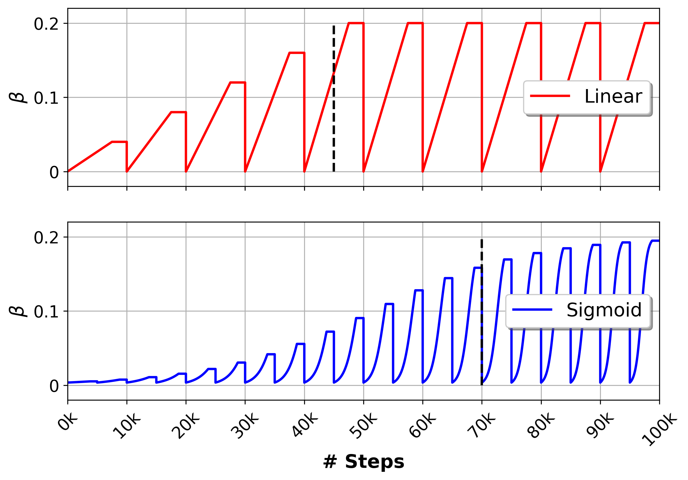

# Giraffe

[](https://www.python.org/)

<p float="left">
  
  
  
</p>

This repository contains training, embedding and sampling code for the "Graph Infused Representation Assembled From a multi-Faceted variational auto-Encoder" (Giraffe) model used to create meaningful molecular representations for small molecules.

An overview of the architecture and training logic of Giraffe looks as follows:


## Quick start
### Anaconda Environment
All packages needed to use GIRAFFE are provided in `environment.yml`. To create a new Anaconda environment from it, run the following:
```bash
conda env create -f environment.yml
```

### Training
Training a new model on a file with SMILES strings can be achieved as follows:
```bash
python train.py data/100k.smi
```
The call above will train a VAE. To train a traditional autoencoder, use the `--no-vae` flag.

To get all the options, call `python train.py --help`:
```
Usage: train.py [OPTIONS] FILENAME

Options:
  -n, --run_name TEXT           Name of the run for saving (filename if omitted).
  -d, --delimiter TEXT          Column delimiter of input file.
  -c, --smls_col TEXT           Name of column that contains SMILES.
  -e, --epochs INTEGER          Nr. of epochs to train.
  -o, --dropout FLOAT           Dropout fraction.
  -b, --batch_size INTEGER      Number of molecules per batch.
  -r, --random                  Randomly sample molecules in each training step.
  -p, --props TEXT              Comma-seperated list of descriptors to use. All, if omitted
  --epoch_steps, --es INTEGER   If random, number of batches per epoch.
  -v, --val FLOAT               Fraction of the data to use for validation.
  -l, --lr FLOAT                Learning rate.
  --lr_fact, --lf FLOAT         Learning rate decay factor.
  --lr_step, --ls INTEGER       LR Step decay after nr. of epochs.
  -a, --after INTEGER           Epoch steps to save model.
  -t, --temp FLOAT              Temperature to use during SMILES sampling.
  --n_sample, --ns INTEGER      Nr. SMILES to sample after each trainin epoch.
  --kernels_gnn, --nk INTEGER   Nr. GNN kernels
  --layers_gnn, --ng INTEGER    Nr. GNN layers
  --layers_rnn, --nr INTEGER    Nr. RNN layers
  --layers_mlp, --nm INTEGER    Nr. MLP layers
  --dim_gnn, --dg INTEGER       Hidden dimension of GNN layers
  --dim_rnn, --dr INTEGER       Hidden dimension of RNN layers
  --dim_tok, --dt INTEGER       Dimension of RNN token embedding
  --dim_mlp, --dm INTEGER       Hidden dimension of MLP layers
  --weight_prop, --wp FLOAT     Factor for weighting property loss in VAE loss
  --weight_kld, --wk FLOAT      Factor for weighting KL divergence loss in VAE loss
  --anneal_type, --at TEXT      Shape of cyclical annealing: linear or sigmoid
  --anneal_cycle, --ac INTEGER  Number of epochs for one KLD annealing cycle
  --anneal_grow, --ag INTEGER   Number of annealing cycles with increasing values
  --anneal_ratio, --ar FLOAT    Fraction of annealing vs. constant KLD weight
  --vae / --no-vae              Whether to train a VAE or only AE
  --scale / --no-scale          Whether to scale all properties from 0 to 1
  --n_proc, --np INTEGER        Number of CPU processes to use
  --help                        Show this message and exit.
```

After training, a config file containing all the used options will be saved in the checkpoints folder. This file is used for later sampling and embedding tasks.

#### Calculated vs. Custom Properties
If the input file only contains SMILES strings (single column, with or without header), Giraffe uses all calculable RDKit properties (scaled from 0 to 1). If the input file contains other numerical columns next to the SMILES, it will use those values as properties. The user has to ensure the properties are scaled to a reasonable range.

### Sampling
To randomly sample up to `100` SMILES strings of maximum length `96` at temperature `0.6` from a trained model checkpoint (in this case epoch `70` of the model `pub_vae_sig`), run the following:
```bash
python sampling.py -r -e 70 -t 0.6 -l 96 -n 100 models/pub_vae_sig
```
If you ommit the `-r` flag, instead of selecting random points in latent space, the model will select random `100` SMILES from the training data and sample SMILES based on those seeds.

Conditional sampling around a single SMILES string of interest using epoch `70` of the pretrained model `pub_vae_sig`:
```bash
python sampling.py -e 70 -t 0.6 -l 96 -n 100 -s "CC1(CC(CC(N1)(C)C)OC2=NN=C(C=C2)C3=C(C=C(C=C3)C4=CNN=C4)O)C" models/pub_vae_sig
```
The sampled SMILES strings are stored in `output/sampled.csv` together with the negative log likelihood score.

To get all available options, call `python sampling.py --help`:
```
Usage: sampling.py [OPTIONS]

Options:
  -c, --checkpoint TEXT  Checkpoint folder.
  -e, --epoch INTEGER    Epoch of models to load.
  -s, --smiles TEXT      Reference SMILES to use as seed for sampling.
  -n, --num INTEGER      How many molecules to sample.
  -t, --temp FLOAT       Temperature to transform logits before for multinomial sampling.
  -l, --maxlen INTEGER   Maximum allowed SMILES string length.
  -o, --out TEXT         Output filename
  -i, --interpolate      Linear interpolation between 2 SMILES (',' separated in -s).
  -r, --random           Randomly sample from latent space.
  -p, --parent           Store parent seed molecule in output file.
  --help                 Show this message and exit.
```

### Embedding
To embed SMILES strings using the pretrained GNN, proceed as follows:
```bash
python embedding.py -f models/pub_vae_sig -e 70 data/1k.txt output/test/embeddings.csv
```
To get all available options, call `python embedding.py --help`:
```
Usage: embedding.py [OPTIONS] INPUT_FILE OUTPUT_FILE

Options:
  -d, --delimiter TEXT      Column delimiter of input file.
  -c, --smls_col TEXT       Name of column that contains SMILES.
  -i, --id_col TEXT         Name of column that contains compound IDs.
  -f, --folder TEXT         Checkpoint folder to load models from.
  -e, --epoch INTEGER       Epoch of models to load.
  -b, --batch_size INTEGER  Batch size to use for embedding.
  -n, --n_mols INTEGER      Number of molecules to randomly sub-sample. Default: 0 = all
  -j, --n_jobs INTEGER      Number of cores to use for data loader.
  --help                    Show this message and exit.
```

## Finetuneing
Finetuneing a trained model on another set of SMILES strings can be achieved as follows:
```bash
python finetune.py data/actives.smi
```
To get all available options, call `python finetune.py --help`:
```
Usage: finetune.py [OPTIONS] FILENAME

Options:
  -c, --checkpoint TEXT        Checkpoint folder.
  -e, --epoch_load INTEGER     Epoch of models to load.
  -n, --run_name TEXT          Name of the run for saving (filename if omitted).
  -d, --delimiter TEXT         Column delimiter of input file.
  -sc, --smls_col TEXT         Name of column that contains SMILES.
  -ne, --epochs INTEGER        Nr. of epochs to train.
  -o, --dropout FLOAT          Dropout fraction.
  -b, --batch_size INTEGER     Number of molecules per batch.
  -r, --random                 Randomly sample molecules in each training step.
  -es, --epoch_steps INTEGER   If random, number of batches per epoch.
  -v, --val FLOAT              Fraction of the data to use for validation.
  -l, --lr FLOAT               Learning rate.
  -lf, --lr_fact FLOAT         Learning rate decay factor.
  -ls, --lr_step INTEGER       LR Step decay after nr. of epochs.
  -a, --after INTEGER          Epoch steps to save model.
  -t, --temp FLOAT             Temperature to use during SMILES sampling.
  -ns, --n_sample INTEGER      Nr. SMILES to sample after each trainin epoch.
  -wp, --weight_prop FLOAT     Factor for weighting property loss in VAE loss
  -wp, --weight_kld FLOAT      Factor for weighting KL divergence loss in VAE loss
  -ac, --anneal_cycle INTEGER  Number of epochs for one KLD annealing cycle
  -ag, --anneal_grow INTEGER   Number of annealing cycles with increasing values
  -ar, --anneal_ratio FLOAT    Fraction of annealing vs. constant KLD weight
  --vae / --no-vae             Whether to train a VAE or only AE
  --scale / --no-scale         Whether to scale all properties from 0 to 1
  -p, --n_proc INTEGER         Number of CPU processes to use
  --help                       Show this message and exit.
```

## KLD Annealing
In the VAE setup, we are emplyoing a growing cyclical annealing schedule. Here's an example of how the schedule looks for the two best performing cyclical annealing strategies for β values during training. Top (red): Linear increase over `4` cycles with cycle sizes of `10’000` steps with `7’500` increasing and `2’500` constant steps. Bottom (blue): Sigmoidal increase over `20` cycles with cycle sizes of `5’000` steps with `3’750` increasing and `1’250` constant steps. Both strategies were allowed to reach a maximum β value of `0.2`, and performed best in the tested benchmarks at the step indicated by a dashed line.



Adapted from https://github.com/haofuml/cyclical_annealing

## Benchmark
To benchmark the obtained representation, use `benchmark.py`. 
It relies on the [Chembench](https://github.com/shenwanxiang/ChemBench) repository, and optionally on the [CDDD](https://github.com/jrwnter/cddd) repository. 
Please follow the installation instructions described in their READMEs.

## Contributing
If you'd like to contribute to GIRAFFE, have a look at `CONTRIBUTING.md`.

## Citing
If you are using GIRAFFE in your research, please cite the following publication: